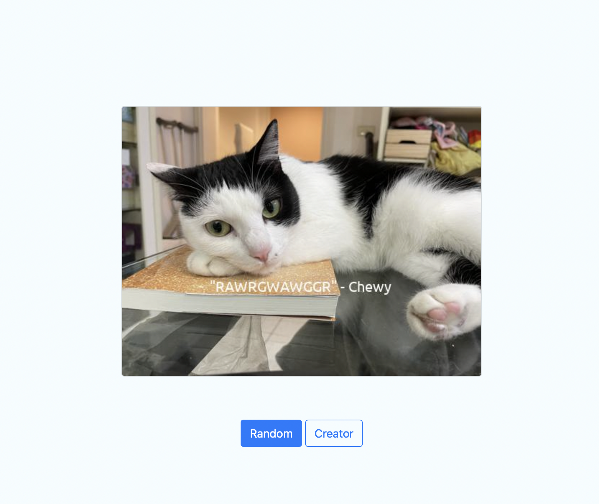
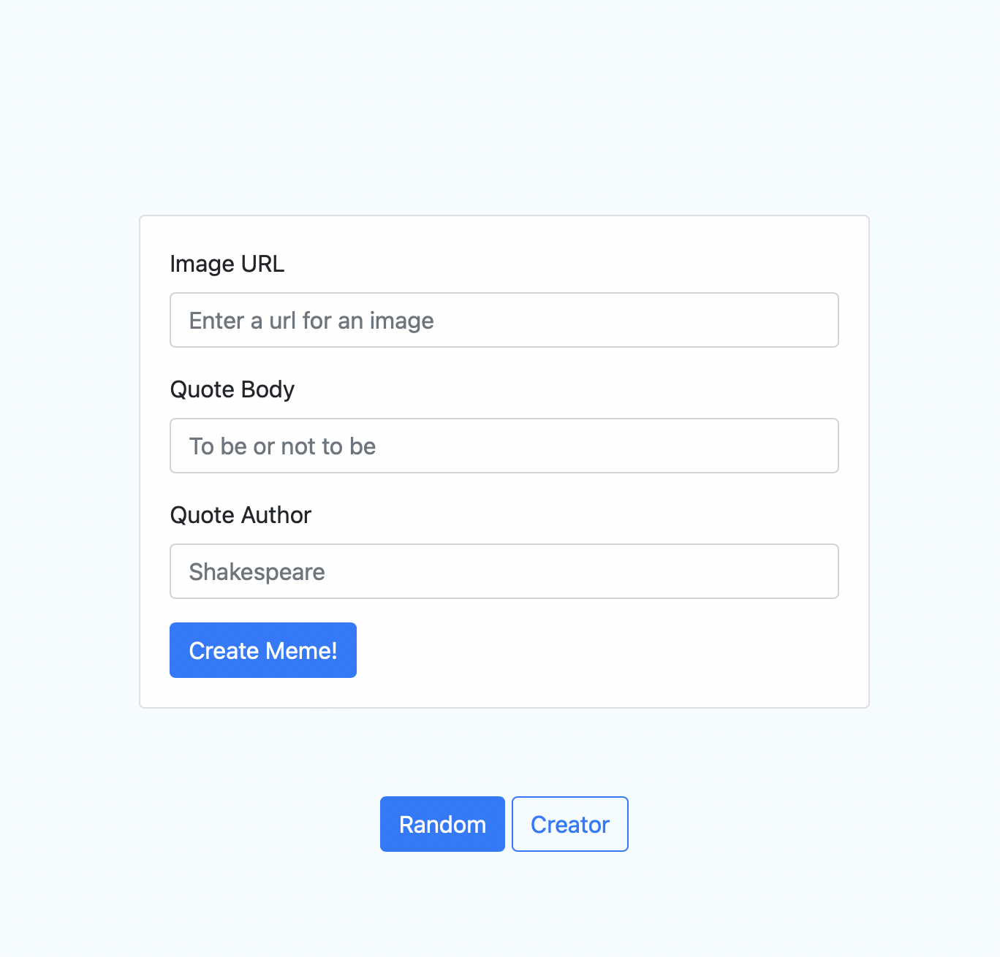

<!-- PROJECT Title -->
<h3 align="center">Meme Generator</h3>

  <p align="center">
    To combine images and quotes to generate meme images.
    <br />


<!-- TABLE OF CONTENTS -->
<details>
  <summary>Table of Contents</summary>
  <ol>
    <li>
      <a href="#about-the-project">About The Project</a>
      <ul>
        <li><a href="#built-with">Built With</a></li>
      </ul>
    </li>
    <li>
      <a href="#getting-started">Getting Started</a>
      <ul>
        <li><a href="#prerequisites">Prerequisites</a></li>
        <li><a href="#installation">Installation</a></li>
      </ul>
    </li>
    <li><a href="#usage">Usage</a></li>
  </ol>
</details>

<!-- ABOUT THE PROJECT -->
## About The Project

</img>

The functions of this module are very simple and easy to use. Here provides the `website interface` and `command line tool` to achieve  making meme photos.

<p align="right">(<a href="#readme-top">back to top</a>)</p>


### Built With
* <a href='https://flask.palletsprojects.com/en/2.2.x/'></img></a> `version=2.2.2`
* <a href='https://pillow.readthedocs.io/en/stable/'></img></a> `version=9.0.1`


### Sub-modules
- **QuoteEngine**
  - `QuoteModel`: to generate a class which has 2 attributes of `body` for quote text and `author` of the quote. Usage as:
  ```QuoteModel('the_quote_text', 'the_author_name')```
  - `IngestorInterface`: abstract class; inherited by the following 4 class which could digest the corresponding file types and output a `list` of `QuoteModel`.
    - `CSVIngestor`
    - `DOCXIngestor`
    - `PDFIngestor`
    - `TXTIngestor`
  - `Ingestor`: an integrated interface of 4 ingestors above. `Ingestor` could digest `csv`, `docx`, `pdf` and `txt` files, whose format like in `./_data/SimpleLines/`, without indicate specific ingestor. Usage as:
  ```Ingester.parse(path_of_file)```
- **MemeGenerator**
  - `MemeGenerator`: to combine image and quote to form a meme photo and save to target folder. 
  Defaults:
  image width: **500** pixels 
  font style: **Ubuntu-R**
  Usage as:
  ```
  meme_maker = MemeGenerator(target_folder_path)
  meme_maker.make_meme(image_path, text, author[, font_path, width])
  ```


<!-- GETTING STARTED -->
## Getting Started
#### Web meme generator
- **Random** : randomly create meme images from `./_data/photos`, and the quote from `./_data/DogQuotes`  
  - built-in photos are dogs and ~~my~~ cat. 
- **Creator** : upload your `image url`, `quote` and the `author's name`
  - _Only digest `png` and `jpg` file type_

#### CLI meme generator
- just run 
  ```sh
  python ./meme.py <-path> <-body> <-author>
  ```

- optional arguments:
  `path`: Image path
  `body`: The meme sentence
  `author`: the author of the sentence


### Prerequisites

* `Python 3.9.12`
* `pip`

### Installation

1. Clone the repo
   ```sh
   git clone https://github.com/kxykxyou/MemeGenerator.git
   ```
2. Install pip packages
   ```sh
   pip install -r requirements.txt
   ```

<p align="right">(<a href="#readme-top">back to top</a>)</p>


<!-- USAGE EXAMPLES -->
## Usage
#### Web meme generator
- No matter create by random or user, the photo will show on the web page immediately
- The creator page is like below, quite easy to operate:
  </img>

#### CLI meme generator
- The generated photos will be saved at `CLIOutput` folder.

<p align="right">(<a href="#readme-top">back to top</a>)</p>


## Acknowledgement
- The web page template, foundation of `app.py` and `meme.py` are from <a href='https://www.udacity.com'>Udacity</a>
- My naughty cat as a model provides cute photos.
